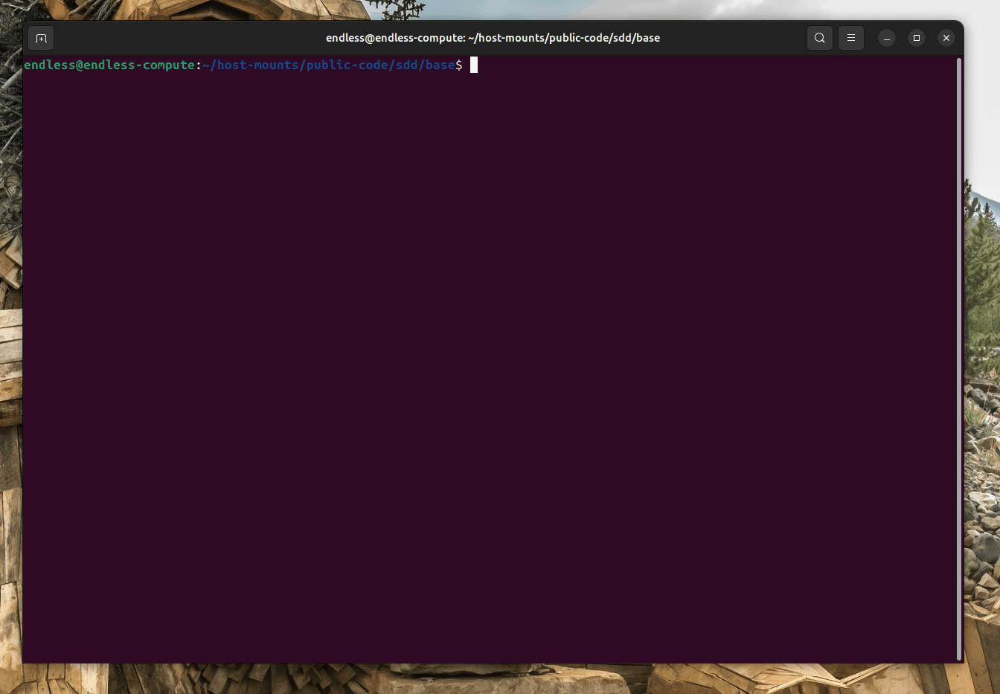
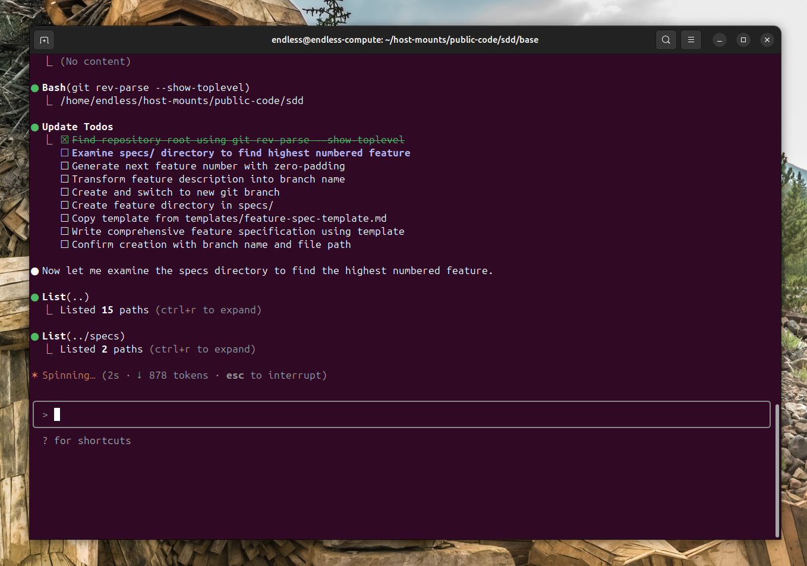

<div align="center">
    <h1>🚀 Specification-Driven Development (SDD)</h1>
    <h3><em>Transforming intent into reality</em></h3>
</div>

<p align="center">
    <strong>An effort to fundamentally invert the traditional relationship between specifications and code.</strong>
</p>

>[!NOTE]
>This repository is heavily influenced by and based on the work of [John Lam](https://github.com/jflam).

---

## Table of Contents

- [🎯 What is SDD?](#-what-is-sdd)
- [📚 Core Philosophy](#-core-philosophy)
- [🌟 Development Phases](#-development-phases)
- [🎯 Experimental Goals](#-experimental-goals)
- [🔧 Prerequisites](#-prerequisites)
- [ Quick Start](#-quick-start)
  - [Understanding the methodology](#understanding-the-methodology)
  - [Using the CLI](#using-the-cli)
  - [STEP 0: Initialize your project](#step-0-initialize-your-project)
  - [STEP 1: Bootstrap the project](#step-1-bootstrap-the-project)
  - [STEP 2: Functional specification clarification](#step-2-functional-specification-clarification)
  - [STEP 3: Generate a plan](#step-3-generate-a-plan)
  - [STEP 4: Have Claude Code validate the plan](#step-4-have-claude-code-validate-the-plan)
  - [STEP 5: Implementation](#step-5-implementation)

## 🎯 What is SDD?

Specification-Driven Development (SDD) **flips the script** on traditional software development. For decades, code has been king — specifications were just scaffolding we built and discarded once the "real work" of coding began. SDD changes this: **specifications become executable**, directly generating working implementations rather than just guiding them.

## 📚 Core Philosophy

SDD is a structured process that emphasizes:

- **Intent-driven development** where specifications define the "_what_" before the "_how_"
- **Rich specification creation** using guardrails and organizational principles
- **Multi-step refinement** rather than one-shot code generation from prompts
- **Heavy reliance** on advanced AI model capabilities for specification interpretation

## 🌟 Development Phases

| Phase | Focus | Key Activities |
|-------|-------|----------------|
| **0-to-1 Development** ("Greenfield") | Generate from scratch | <ul><li>Start with high-level requirements</li><li>Generate specifications</li><li>Plan implementation steps</li><li>Build production-ready applications</li></ul> |
| **Creative Exploration** | Parallel implementations | <ul><li>Explore diverse solutions</li><li>Support multiple technology stacks & architectures</li><li>Experiment with UX patterns</li></ul> |
| **Iterative Enhancement** ("Brownfield") | Brownfield modernization | <ul><li>Add features iteratively</li><li>Modernize legacy systems</li><li>Adapt processes</li></ul> |

## 🎯 Experimental Goals

Our research and experimentation focus on:

### Technology Independence

- Create applications using diverse technology stacks
- Validate the hypothesis that SDD is a process not tied to specific technologies, programming languages, or frameworks

### Enterprise Constraints

- Demonstrate mission-critical application development
- Incorporate organizational constraints (cloud providers, tech stacks, engineering practices)
- Support enterprise design systems and compliance requirements

### User-Centric Development

- Build applications for different user cohorts and preferences
- Support various development approaches (from vibe-coding to AI-native development)

### Creative & Iterative Processes

- Validate the concept of parallel implementation exploration
- Provide robust iterative feature development workflows
- Extend processes to handle upgrades and modernization tasks  

## 🔧 Prerequisites

To use this repository effectively:

- **Linux** ([WSL2](https://learn.microsoft.com/windows/wsl/install) if you're using Windows) or **macOS**
      - This is required for the embedded helper scripts. In the future, we will support Windows natively as well.
- Agentic AI developer tools:
      - [Visual Studio Code with GitHub Copilot](https://code.visualstudio.com/)
      - [Claude Code](https://www.anthropic.com/claude-code)
      - [Gemini CLI](https://github.com/google-gemini/gemini-cli)
- [uv](https://docs.astral.sh/uv/) - we use this instead of `pip` for package management
- [Python 3.12](https://www.python.org/downloads/) at least

>[!NOTE]
>While the repository uses Claude Code conventions, the pattern is applicable to _any_ modern agentic AI tool. You might need to make certain tweaks to get it to work properly.

## 🚀 Quick Start

### Understanding the methodology

Start by reading the core documents to familiarize yourself with the principles:

1. [**`sdd.md`**](./sdd.md) - The complete SDD methodology.
2. [**`specify-proposal.md`**](./specify-proposal.md) - Vision for tooling to support SDD.

### Using the CLI

To help bootstrap the process, we have build a Command Line Interface (CLI) tool, called `specify`, that will help you create the required artifacts for your project. To bootstrap a project, you will need to use the `specify init` command.

#### Option 1: Using uvx (no installation)

```bash
uvx --from git+https://github.com/localden/sdd.git specify init <PROJECT_NAME>
```

#### Option 2: Install globally

```bash
uv tool install git+https://github.com/localden/sdd.git
```

### STEP 0: Initialize your project

You can use the Specify CLI to bootstrap your project, which will bring in the required artifacts in your environment. Run:

```bash
specify init <project_name>
```


You will be prompted to select the AI agent you are using. You can also proactively specify it directly in the terminal:

```bash
specify init <project_name> --ai claude
specify init <project_name> --ai gemini
specify init <project_name> --ai copilot
```

The CLI will check if you have Claude Code or Gemini CLI installed. If you do not, or you prefer to get the templates without checking for the right tools, use `--ignore-agent-tools` with your command:

```bash
specify init <project_name> --ai claude --ignore-agent-tools
```

### STEP 1: Bootstrap the project

The first step should be creating a new project scaffolding. Use `/new_feature` and then specify the concrete requirements for the project you want to develop.



>[!IMPORTANT]
>Be as explicit as possible about what you are trying to build. Typically, you might want to consider voice interaction with the model.

An example prompt, as described by John Lam, can be:

```text
Develop Taskify, a team productivity platform. It should allow users to create projects, add team members,
assign tasks, comment and move tasks between boards in Kanban style. In this initial phase for this feature,
let's call it "Create Taskify," let's have multiple users but the users will be declared ahead of time, predefined.
I want five users in two different categories, one product manager and four engineers. Let's create three
different sample projects. Let's have the standard Kanban columns for the status of each task, such as "To Do,"
"In Progress," "In Review," and "Done." There will be no login for this application as this is just the very
first testing thing to ensure that our basic features are set up. For each task in the UI for a task card,
you should be able to change the current status of the task between the different columns in the Kanban work board.
You should be able to leave an unlimited number of comments for a particular card. You should be able to, from that task
card, assign one of the valid users. When you first launch Taskify, it's going to give you a list of the five users to pick
from. There will be no password required. When you click on a user, you go into the main view, which displays the list of
projects. When you click on a project, you open the Kanban board for that project. You're going to see the columns.
You'll be able to drag and drop cards back and forth between different columns. You will see any cards that are
assigned to you, the currently logged in user, in a different color from all the other ones, so you can quickly
see yours. You can edit any comments that you make, but you can't edit comments that other people made. You can
delete any comments that you made, but you can't delete comments anybody else made.
```

After this prompt is entered, you should see Claude Code kick off the planning and spec drafting process.



Once this step is completed, you should have a new branch created (e.g., `001-create-taskify`), as well as a new specification in the `specs/001-create-taskify` directory.

The produced specification should contain a set of user stories and functional requirements.


### STEP 2: Functional specification clarification

With the baseline specification now created, you can go ahead and clarify any of the requirements that were not captured properly within the first shot attempt. For example, a prompt could be this:

```text
For each sample project or project that you create there should be a variable number of tasks between 5 and 15
tasks for each one randomly distributed into different states of completion. Make sure that there's at least
one task in each stage of completion.
```

You should also ask Claude Code to validate the **Review & Acceptance Checklist**, checking off the things that are validated/pass the requirements, and leave the ones that are not unchecked. The following prompt can be used:

```text
Read the review and acceptance checklist, and check off each item in the checklist if the feature spec meets the criteria. Leave it empty if it does not.
```

### STEP 3: Generate a plan

You can now be specific about the tech stack and other technical requirements. You can use the `/generate_plan` command that is built into this repository, with the following prompt:

```text
We are going to generate this using .NET Aspire, using Postgres as the database. The frontend should use
Blazor server with drag-and-drop task boards, real-time updates. There shoul dbe a REST API created with a projects API,
tasks API, and a notifications API.
```

The output of this step will include a number of implementation detail documents, with your directory tree resembling this:

```text
.
├── base
│	├── CLAUDE.md
│	├── memory
│	│	└── constitution.md
│	└── templates
│	    ├── feature-spec-template.md
│	    └── implementation-plan-template.md
├── gen.sh
├── media
│	├── claude-code-starter.gif
│	└── generate-plan.gif
├── README.md
├── sdd.md
├── specify-proposal.md
└── specs
    └── 001-create-taskify
        ├── feature-spec.md
        ├── implementation-details
        │		 ├── 00-research.md
        │		 ├── 01-environment-setup.md
        │		 ├── 02-data-model.md
        │		 ├── 03-api-contracts.md
        │		 ├── 04-algorithms.md
        │		 ├── 05-integrations.md
        │		 ├── 06-contract-tests.md
        │		 ├── 07-integration-tests.md
        │		 └── 08-inter-library-tests.md
        ├── implementation-plan.md
        └── manual-testing.md
```

Check the `00-research.md` document to ensure that the right tech stack is used, based on your instructions. You can ask Claude Code to refine it if any of the components stand out, or even have it check the locally-installed version of the platform/framework you want to use (e.g., .NET).

Additionally, you might want to ask Claude Code to research details about the chosen tech stack if it's something that is rapidly changing (e.g., .NET Aspire, JS frameworks), with a prompt like this:

```text
I want you to go through the implementation plan and implementation details, looking for areas that could
benefit from additional research as .NET Aspire is a rapidly changing library. For those areas that you identify that
require further research, I want you to update the research document with additional details about the specific
versions that we are going to be using in this Taskify application and spawn parallel research tasks to clarify
any details using research from the web.
```

During this process, you might find that Claude Code gets stuck researching the wrong thing - you can help nudge it in the right direction with a prompt like this:

```text
I think we need to break this down into a series of steps. First, identify a list of tasks
that you would need to do during implementation that you're not sure of or would benefit
from further research. Write down a list of those tasks. And then for each one of these tasks,
I want you to spin up a separate research task so that the net results is we are researching
all of those very specific tasks in parallel. What I saw you doing was it looks like you were
researching .NET Aspire in general and I don't think that's gonna do much for us in this case.
That's way too untargeted research. The research needs to help you solve a specific targeted question.
```

>[!NOTE]
>Claude Code might be over-eager and add components that you did not ask for. Ask it to clarify the rationale and the source of the change.

### STEP 4: Have Claude Code validate the plan

With the plan in place, you should have Claude Code run through it to make sure that there are no missing pieces. You can use a prompt like this:

```text
Now I want you to go and audit the implementation plan and the implementation detail files.
Read through it with an eye on determining whether or not there is a sequence of tasks that you need
to be doing that are obvious from reading this. Because I don't know if there's enough here. For example,
when I look at the core implementation, it would be useful to reference the appropriate places in the implementation
details where it can find the information as it walks through each step in the core implementation or in the refinement.
```

This helps refine the implementation plan and helps you avoid potential blind spots that Claude Code missed in its planning cycle. Once the initial refinement pass is complete, ask Claude Code to go through the checklist once more before you can get to the implementation.

You can also ask Claude Code (if you have the [GitHub CLI](https://docs.github.com/en/github-cli/github-cli) installed) to go ahead and create a pull request from your current branch to `main` with a detailed description, to make sure that the effort is properly tracked.

>[!NOTE]
>Before you have the agent implement it, it's also worth prompting Claude Code to cross-check the details to see if there are any over-engineered pieces (remember - it can be over-eager). If over-engineered components or decisions exist, you can ask Claude Code to resolve them. Ensure that Claude Code follows the [constitution](base/memory/constitution.md) as the foundational piece that it must adhere to when establishing the plan.

### STEP 5: Implementation

Once ready, instruct Claude Code to implement your solution (example path included):

```text
implement specs/002-taskify-kanban/implementation-plan.md
```

Claude Code will spring into action and will start creating the implementation.

>[!IMPORTANT]
>Claude Code will execute local CLI commands (such as `dotnet`) - make sure you have them installed on your machine.

Once the implementation step is done, ask Claude Code to try to run the application and resolve any emerging build errors. If the application runs, but there are _runtime errors_ that are not directly available to Claude Code through CLI logs (e.g., errors rendered in browser logs), copy and paste the error in Claude Code and have it attempt to resolve it.
